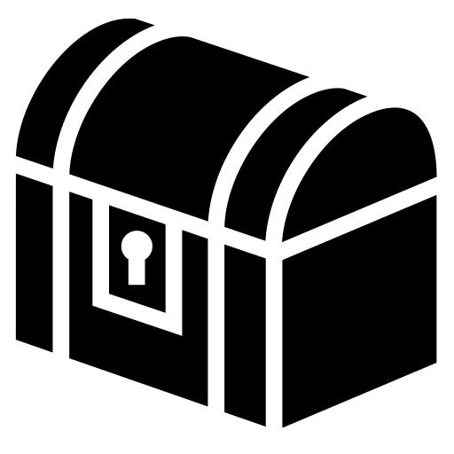
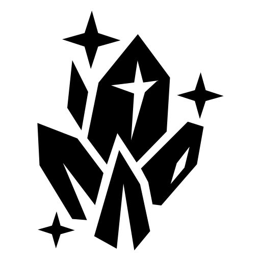
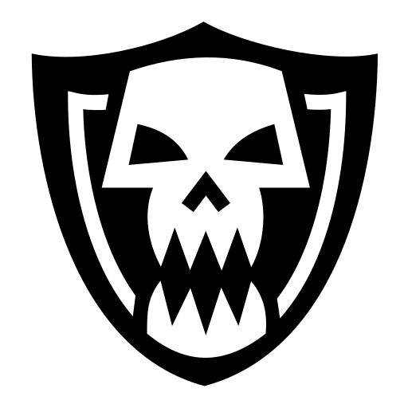
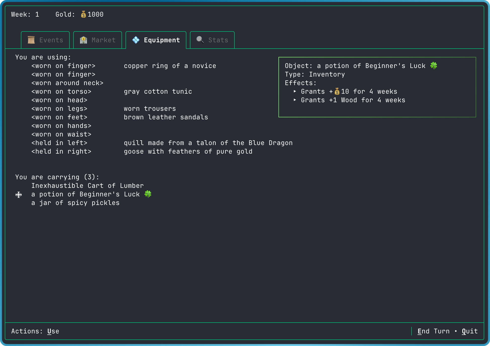
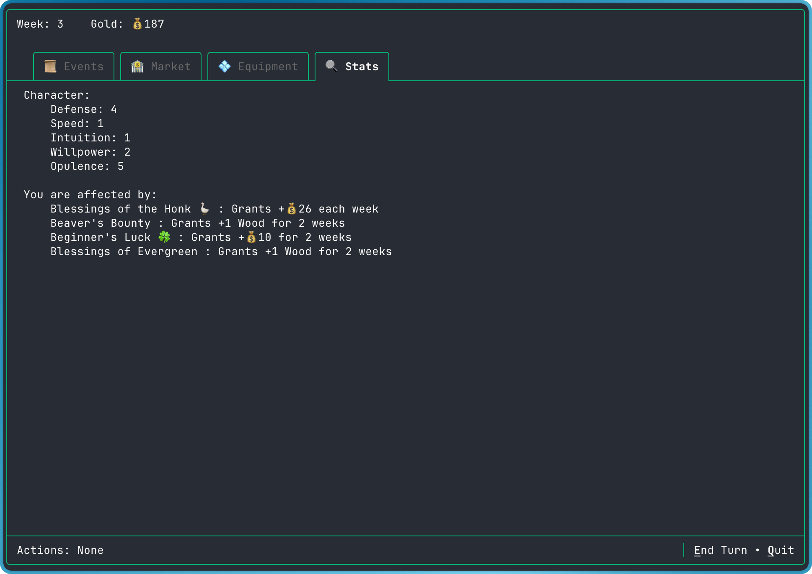
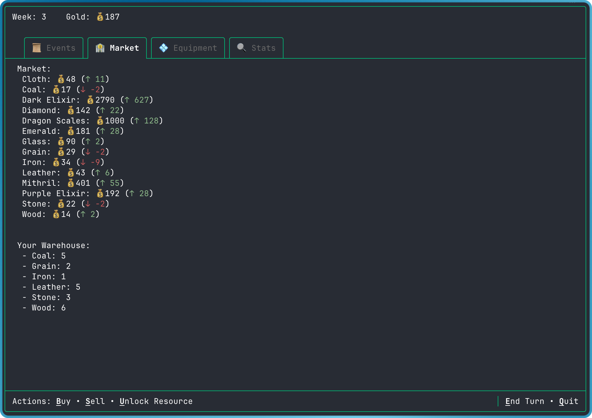
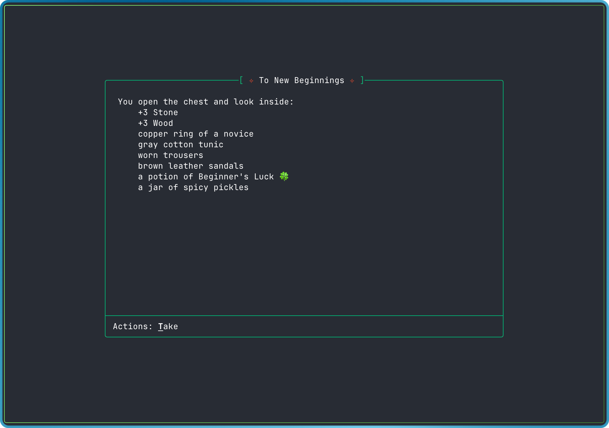

<h1 align="center">
     
     
     
     Trader Vlad's
</h1>

A turn-based fantasy game of strategy, trade and loot. Built for play in the terminal with Golang and [Bubble Tea](https://github.com/charmbracelet/bubbletea) framework.  

## Early Game Screenshots

### Equipment

### Stats

### Market
 

### Story   
 

## Author's Note

I've started this game primarily for fun and learning. I wanted to get more exposure building terminal apps in Go and Bubble Tea framework. Trader Vlad's is an amalgamation of many different classics. Some games shine through in subtle aspects, while others have inspired core game mechanics.

Drawing on inspiration and influence from:
- [DarkMists](https://darkmists.org/)
- Diablo II
- Heroes of Might and Magic III
- Clash of Clans
